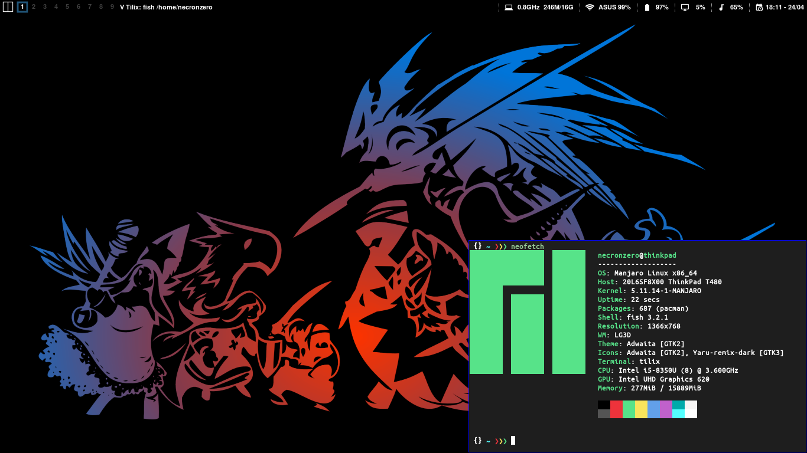

# Dotfiles 

## What are dotfiles?

Dotfiles are the customization files that are used to personalize your Linux or other Unix-based system.
You can tell that a file is a dotfile because the name of the file will begin with a dot!
The period at the beginning of a filename or directory name indicates that it is a hidden file or directory.
This repository contains my personal dotfiles.
They are stored here for convenience so that I may quickly access them on new machines or new installs.

### Thinkpad T480
No need to mess with thinkfan anymore, configure throttled and temp limit should be at 90ºC with fan control levels [0-7] enabled.